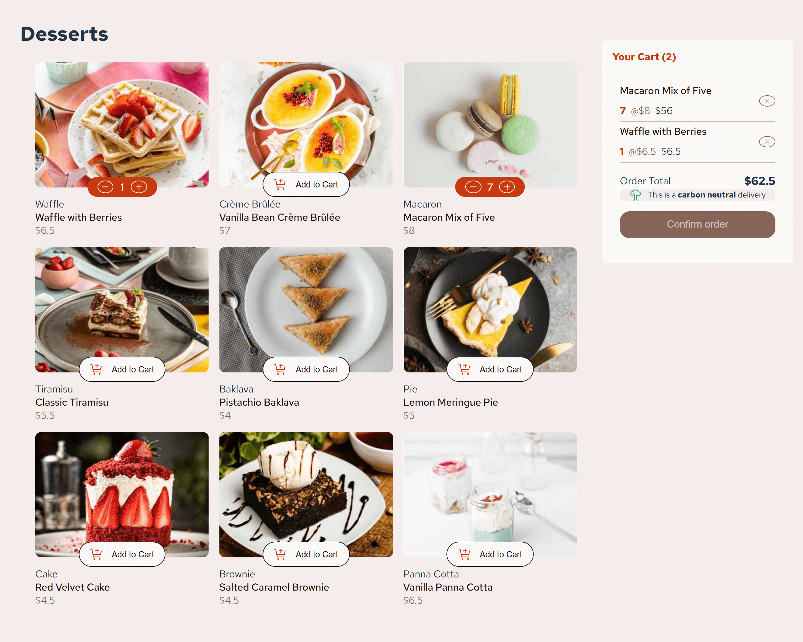

# Frontend Mentor - Product list with cart solution

This is a solution to the [Product list with cart challenge on Frontend Mentor](https://www.frontendmentor.io/challenges/product-list-with-cart-5MmqLVAp_d).

## Table of contents

- [Overview](#overview)
  - [The challenge](#the-challenge)
  - [Screenshot](#screenshot)
  - [Links](#links)
- [My process](#my-process)
  - [Built with](#built-with)
  - [What I learned](#what-i-learned)
  - [Continued development](#continued-development)
  - [Useful resources](#useful-resources)


## Overview
This project is a responsive shopping interface built with React.
It showcases a clean desktop design along with interactive features such as a confirm-order popup and add-to-cart functionality.
The layout is optimized for both desktop and mobile views, ensuring a smooth user experience across all devices
### The challenge

Users should be able to:

- Add items to the cart and remove them
- Increase/decrease the number of items in the cart
- See an order confirmation modal when they click "Confirm Order"
- Reset their selections when they click "Start New Order"
- View the optimal layout for the interface depending on their device's screen size
- See hover and focus states for all interactive elements on the page

### Screenshot



### Links

- Solution URL: [Add solution URL here](https://your-solution-url.com)
- Live Site URL: [Add live site URL here](https://your-live-site-url.com)

## My process

### Built with

- Semantic HTML5 markup
- CSS custom properties
- Flexbox
- CSS Grid
- Mobile-first workflow
- [React](https://reactjs.org/) - JS library


### What I learned
Maneged state, passed props, and created reusable components.

To see how you can add code snippets, see below:
```jsx
const increaseCartCount = (product)=>{

        setCart(prevCart=>{
            const existing = prevCart.find(item=> item.id === product.id )
            if(existing){
                return prevCart.map(item=>
                    item.id === product.id ? {...item,
                         sumTotal: prevCart.reduce((acc, item) => acc + item.totalPrice, 0), 
                         quantity: item.quantity+1 ,
                         totalPrice: item.price*(item.quantity+1)}
                         : item
                )
            }
           return [...prevCart, {...product,
            quantity:1,
            totalPrice: product.price,
            sumTotal: prevCart.reduce((acc, item) => acc + item.totalPrice, 0) + product.price}]
        })
    }
```


### Continued development
In the future I plan to:
- Add more product categories and filtering options.
- Add animations to enhance the user experience.
- Connect the project to a backend API for real project data.


### Useful resources

- [React Docs](https://react.dev) - This is an amazing article which helped me finally understand XYZ. I'd recommend it to anyone still learning this concept.


- Website - Coming soon
- Frontend Mentor - [@Joseph-Oluwapelumi31](https://www.frontendmentor.io/profile/Joseph-Oluwapelumi31)
- Twitter - Coming soon

